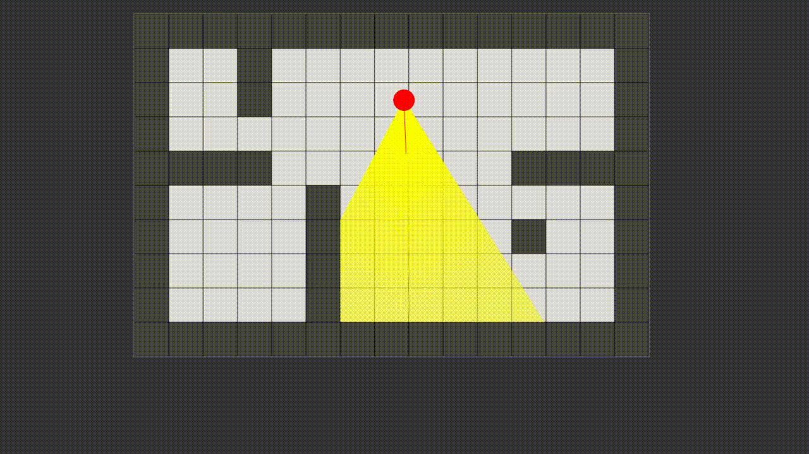
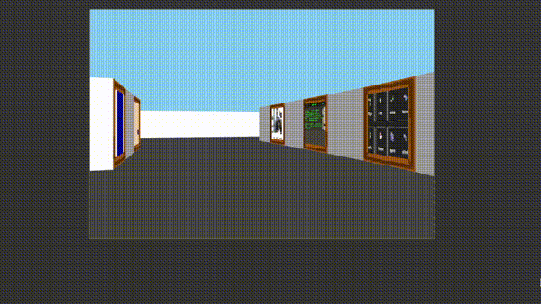

# myExpo

An exposition of my projects as an art gallery in Doom-like view, implementing [raycast](https://en.wikipedia.org/wiki/Ray_casting#Ray_casting_in_early_computer_games).

## Images

### Casting rays

Early map video.

### View


### Check online [Here](https://davideaded.github.io/myExpo/)

---

## How to launch it

1. Clone the repository:
   ```bash
   git clone https://github.com/davideaded/myExpo.git
   cd myExpo
   ```
2. Open index.html
